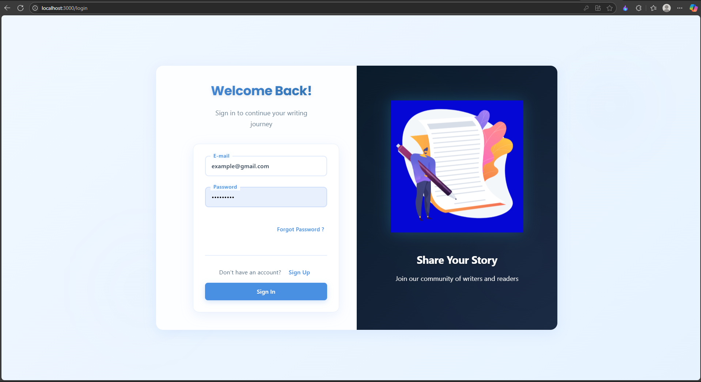
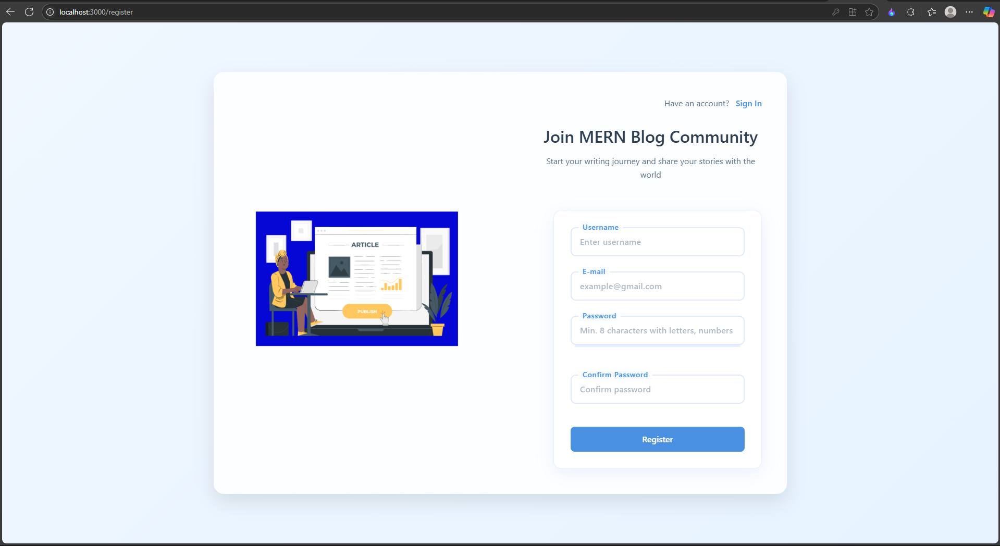

# MERN Stack Blog Platform

A modern, full-featured blogging platform built with the MERN stack (MongoDB, Express.js, React.js, Node.js). Features a beautiful UI with a responsive design, rich text editing, image uploads, user authentication, and more.

## 📸 Project Showcase

Here's a visual overview of the key features and interfaces in our blog platform:

### Authentication Pages

<div style="display: flex; gap: 20px; margin-bottom: 20px;">
    <div>
        
        <p align="center"><em>Login Page with Dark Theme Support</em></p>
    </div>
    <div>
        
        <p align="center"><em>Registration Page with Form Validation</em></p>
    </div>
</div>

### Home Page & Story Cards


_The main blog feed with story cards in a modern, responsive grid layout_

### Rich Text Editor


_Full-featured rich text editor with image upload support_

### User Profile


_Customizable user profiles with story management_

### Reading List


_Personalized reading list for saved articles_

### Comments & Interactions


_Interactive comment system with real-time updates_

### Responsive Design

<div style="display: flex; gap: 10px;">
    
    
</div>
*Responsive design that works beautifully across all devices*

## ✨ Features

- 🔐 User authentication (Register, Login, Reset Password)
- 📝 Rich text editor for writing blog posts
- 📸 Image upload support for blog posts and user profiles
- 💾 Draft system for saving unfinished posts
- 🏷️ Tag system for categorizing posts
- 👍 Like and comment system
- 📚 Reading list functionality
- 🌓 Light/Dark theme support
- 📱 Fully responsive design
- ✨ Modern UI with animations and transitions

## 🚀 Technologies Used

### Backend

- Node.js
- Express.js
- MongoDB with Mongoose
- JWT for authentication
- Multer for file uploads
- Nodemailer for email functionality
- Express Async Handler
- CORS
- Bcrypt for password hashing

### Frontend

- React.js
- React Router v6
- Axios for API calls
- CKEditor 5 for rich text editing
- React Icons
- CSS3 with custom properties
- Modern CSS features (Grid, Flexbox, Animations)

## 🛠️ Installation & Setup

### Prerequisites

- Node.js (v14 or higher)
- MongoDB
- Git

### Backend Setup

1. Clone the repository:

   ```powershell
   git clone <repository-url>
   cd mern-blog-v2-main
   ```

2. Install backend dependencies:

   ```powershell
   cd Backend
   npm install
   ```

3. Create a `config.env` file in the Backend directory with the following variables:

   ```env
   MONGO_URI=your_mongodb_connection_string
   JWT_SECRET_KEY=your_jwt_secret
   JWT_EXPIRE=7d
   SMTP_HOST=your_smtp_host
   SMTP_PORT=your_smtp_port
   SMTP_USER=your_smtp_email
   SMTP_PASS=your_smtp_password
   ```

4. Start the backend server:
   ```powershell
   npm start
   ```
   The server will run on http://localhost:5000

### Frontend Setup

1. Open a new terminal and navigate to the Frontend directory:

   ```powershell
   cd ../Frontend
   ```

2. Install frontend dependencies:

   ```powershell
   npm install
   ```

3. Start the frontend development server:
   ```powershell
   npm start
   ```
   The application will open in your default browser at http://localhost:3000

## 📁 Project Structure

```
.
├── Backend/        # Server-side code
├── Frontend/       # Client-side code
├── screenshots/    # Project screenshots and demos
└── docs/          # Documentation files

```

### Backend Structure

```
Backend/
├── Controllers/     # Request handlers
├── Helpers/        # Utility functions
├── Middlewares/    # Custom middleware
├── Models/         # Database models
├── Routers/        # API routes
└── public/         # Static files (images)
```

### Frontend Structure

```
Frontend/
├── public/         # Static assets
└── src/
    ├── components/ # React components
    ├── Context/    # React context
    └── Css/        # Stylesheets
```

## 🌟 Key Features Explained

### Authentication

- JWT-based authentication
- Password reset via email
- Protected routes
- Persistent login state

### Blog Posts

- Create, edit, and delete posts
- Rich text editor with image support
- Draft system for works in progress
- Tag system for categorization
- Like and comment functionality

### User Features

- Customizable user profiles
- Reading list for saved articles
- Comment on posts
- Like posts
- Follow other users

### UI/UX

- Responsive design for all devices
- Modern animations and transitions
- Light/Dark theme support
- Loading states and error handling
- Intuitive navigation

## 🔒 Security Features

- Password hashing with bcrypt
- JWT token authentication
- Protected API routes
- Secure file upload handling
- CORS configuration
- Input validation and sanitization

## 🤝 Contributing

Contributions are welcome! Please feel free to submit a Pull Request.

## 📝 License

This project is licensed under the ISC License - see the [LICENSE](LICENSE) file for details.

## 👨‍💻 Author

Gilbert Hutapea - [GitHub Profile](https://github.com/gilberthutapea)

## 💬 Support

For support, email your-email@example.com or create an issue in this repository.

---

Made with ❤️ using the MERN Stack
